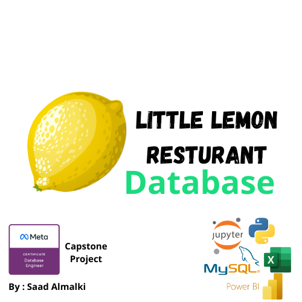

# Little Lemon Database Project

## Overview



This project is the **Capstone Project** for the [Meta Database Engineering Professional Certificate in Coursera](https://www.coursera.org/professional-certificates/meta-database-engineer). The goal of this project is to design, implement, and analyze a relational database for **Little Lemon**, a restaurant business. The project involves:

- **Designing a database schema** in MySQL Workbench
- **Creating and populating tables** using MySQL
- **Performing data analysis** using Power BI/Tableau
- **Visualizing key insights** related to sales, orders, and customers

## Features
- **MySQL Relational Database** with optimized schema design
- **Dummy Data** generated for realistic insights
- **Power BI Reports** for sales analysis, customer insights, and order trends
- **Key Stored Procedures** for managing bookings

## Database Schema
The database consists of multiple tables:
- `Customers` - Stores customer information
- `Orders` - Stores order details including sales and delivery data
- `Cuisines` - Stores different cuisine types
- `Courses` - Stores different main courses
- `Starters`, `Desserts`, `Drinks`, `Sides` - Stores different food items
- `OrderDetails` - Stores details of each order

## ER Diagram
The entity-relationship diagram (ERD) was designed using MySQL Workbench to represent relationships between tables.


## Power BI Analysis
Power BI was used to analyze and visualize key metrics such as:
- **Total Sales** (Card Visualization)

- **Sales by City** (Column Chart)

- **Top Selling Courses** (Bar Chart)

- **Orders per Customer** (Pie Chart) `Visualizations`
- **Sales Over Time** (Line Chart) `Visualizations`
- **Delivery Cost per City** (Map Visualization) `Visualizations`
- **Total Discounts Given** (Card Visualization) `Visualizations`
## Installation & Setup
### Requirements:
- **MySQL Server & Workbench**
- **Microsoft Excel**
- **Power BI Desktop**

### Steps to Run the Project:
1. Clone this repository:
   ```bash
   git clone https://github.com/Saad711T/Little_Lemon_DB.git
   ```
2. Import the **MySQL Schema**:
3. Open **Power BI Desktop** and load the provided Excel dataset for analysis.
4. Explore the Power BI Dashboard to gain insights.

## License
This project is licensed under the **MIT License**. See the `LICENSE` file for details.

## Author
- **Saad Almalki**  
- **Meta Database Engineer Professional Certificate - Capstone Project**
